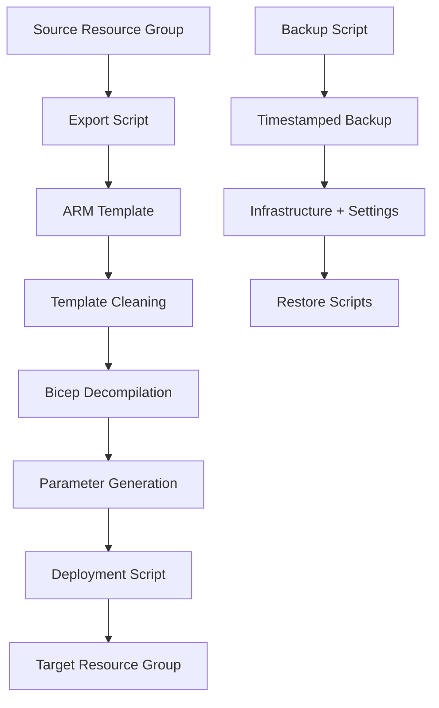

# 🚀 Azure Resource Group Cloning & Backup Toolkit

[](https://github.com/PowerShell/PowerShell)
[](LICENSE)

A powerful PowerShell toolkit for Azure Resource Group management that enables seamless cloning between environments and reliable disaster recovery backups. This solution demonstrates advanced Infrastructure as Code (IaC) techniques, ARM template manipulation, and Bicep decompilation.

## ✨ Key Features

- **🔄 Environment Cloning**: Clone entire resource groups from DEV → SIT → PROD with intelligent name transformation
- **💾 Disaster Recovery**: Create timestamped backups with complete infrastructure and configuration preservation
- **🧹 Smart Template Cleaning**: Automatically removes unsupported resources and read-only properties
- **📝 Bicep Generation**: Decompiles cleaned ARM templates to modern Bicep files
- **🔐 Secret Management**: Intelligent handling of sensitive data with masking capabilities
- **⚡ Automated Deployment**: Generates deployment scripts with validation and what-if support
- **🎯 Deterministic Processing**: Consistent, repeatable results across multiple runs

## 🏗️ Architecture Overview



## 📋 Prerequisites

- **PowerShell 7.2+** - Modern PowerShell with cross-platform support
- **Azure CLI** - Latest version installed and configured
- **Az PowerShell Module** - `Install-Module -Name Az -AllowClobber -Force`
- **Bicep CLI** - `az bicep install`
- **Appropriate Azure Permissions**:
  - Reader role on source resource group
  - Contributor role on target resource group

## 🚀 Quick Start

### 1. Clone the Repository

```bash
git clone https://github.com/bradmca/azure-clone-resource-group.git
cd azure-clone-resource-group
```

### 2. Configure Environment

```bash
# Copy the example environment file
cp example.env .env

# Edit with your specific values
notepad .env  # or your preferred editor
```

### 3. Authenticate to Azure

```powershell
# Login to Azure
Connect-AzAccount

# Set the correct subscription
$subscriptionId = "your-subscription-id"
Select-AzSubscription -SubscriptionId $subscriptionId
```

## 📖 Usage Guide

### Environment Cloning (DEV → SIT)

Clone a resource group to a new environment with automatic name transformation:

```powershell
.\Export-AzureResourceGroup.ps1
```

**What happens:**
1. Discovers all resources in the source RG
2. Exports and cleans ARM template
3. Decompiles to Bicep with proper formatting
4. Generates environment-specific parameters
5. Creates deployment script with validation

### Disaster Recovery Backup

Create a complete backup for disaster recovery:

```powershell
.\Backup-AzureResourceGroup.ps1
```

**Backup includes:**
- Complete infrastructure definition
- All Function App settings (including secrets)
- Restore scripts for quick recovery
- Metadata for tracking

## 🎯 Advanced Features

### Intelligent Name Transformation

The toolkit automatically handles naming conventions:

| Resource Type | Transformation | Example |
|---------------|----------------|---------|
| Storage Accounts | Prefix + Truncate | `devstore` → `sitstore123456789012` |
| Cosmos DB | Prefix + Truncate | `devcosmos` → `sitcosmos123456789012345678901234` |
| Service Bus | Prefix + Truncate | `devsb` → `sitsb12345678901234567890123456789012345678901234567890` |
| Function Apps | Simple Replace | `function-dev` → `function-sit` |

### Secret Handling

- **Cloning**: Secrets are masked as `MANUAL_CONFIGURATION_REQUIRED`
- **Backup**: Full secret values are preserved securely
- **Deployment**: Manual configuration checklist generated

### Validation & What-If

```powershell
# Validate Bicep syntax
.\exported-bicep\deploy-sit.ps1 -Validate

# Preview changes
.\exported-bicep\deploy-sit.ps1 -WhatIf

# Deploy
.\exported-bicep\deploy-sit.ps1
```

## 📁 Project Structure

```
azure-clone-resource-group/
├── 📄 Export-AzureResourceGroup.ps1    # Main cloning script
├── 📄 Backup-AzureResourceGroup.ps1    # Backup script
├── 📄 example.env                      # Environment template
├── 📄 .gitignore                       # Git ignore rules
├── 📄 README.md                        # This file
└── 📁 exported-bicep/                  # Generated output
    ├── 📄 main.bicep                   # Decompiled Bicep template
    ├── 📄 template.json                # Raw ARM export
    ├── 📄 template.clean.json          # Cleaned ARM template
    ├── 📄 parameters.sit.json          # SIT parameters
    ├── 📄 deploy-sit.ps1               # Deployment script
    └── 📄 PREDEPLOY.md                 # Configuration checklist
```

## 🧪 Testing

### Test Environment Setup

```powershell
# Create test resource groups
az group create -n rg-test-dev -l uksouth
az group create -n rg-test-sit -l uksouth

# Deploy simple resources for testing
az deployment group create `
  -g rg-test-dev `
  --template-file test-template.json `
  --parameters test-parameters.json
```

### Run Tests

```powershell
# Test cloning
.\Export-AzureResourceGroup.ps1

# Validate output
.\exported-bicep\deploy-sit.ps1 -Validate

# Test backup
.\Backup-AzureResourceGroup.ps1
```

## 🔧 Configuration Options

### Script Parameters

| Parameter | Default | Description |
|-----------|---------|-------------|
| `SourceResourceGroup` | `rg-your-project-dev` | Source RG name |
| `TargetResourceGroup` | `rg-your-project-sit` | Target RG name |
| `SourceEnvironment` | `dev` | Source environment tag |
| `TargetEnvironment` | `sit` | Target environment tag |
| `Location` | `uksouth` | Azure region |

### Customization

Edit the scripts to modify:
- Resource filtering rules
- Name transformation patterns
- Parameter generation logic
- Validation requirements

## 🛡️ Security Considerations

- ✅ Backups are stored locally with encryption
- ✅ Secrets are masked in cloning scenarios
- ✅ `.gitignore` prevents accidental commits
- ✅ No hardcoded credentials in scripts
- ⚠️ Store backup folders securely
- ⚠️ Review `PREDEPLOY.md` before deployment

## 🤝 Contributing

Contributions are welcome! Please feel free to submit issues and enhancement requests.

### Development Setup

```bash
# Fork the repository
git clone https://github.com/bradmca/azure-clone-resource-group.git

# Create a feature branch
git checkout -b feature/amazing-feature

# Make your changes
# ... 

# Commit and push
git commit -m "Add amazing feature"
git push origin feature/amazing-feature
```

## 📚 Learning Resources

This project demonstrates:
- **Infrastructure as Code (IaC)** best practices
- **ARM Template** manipulation and optimization
- **Bicep** language adoption
- **PowerShell** advanced scripting
- **Azure CLI** integration
- **DevOps** automation patterns

## 📄 License

This project is licensed under the MIT License - see the [LICENSE](LICENSE) file for details.

## 🙏 Acknowledgments

- Azure team for the excellent Bicep tooling
- PowerShell community for inspiration
- All contributors who help improve this project

## 📞 Support

If you run into issues or have questions:

1. Check the [Issues](https://github.com/bradmca/azure-clone-resource-group/issues) page
2. Review the troubleshooting section below
3. Create a new issue with details

### Troubleshooting

| Issue | Solution |
|-------|----------|
| `az bicep decompile` fails | Ensure Bicep CLI is installed (`az bicep install`) |
| Permission denied | Check Azure RBAC permissions on resource groups |
| Template validation errors | Review generated `PREDEPLOY.md` for manual configuration |
| Name conflicts | Verify globally unique resource naming rules |

---

**⭐ If this project helps you, please give it a star!**
